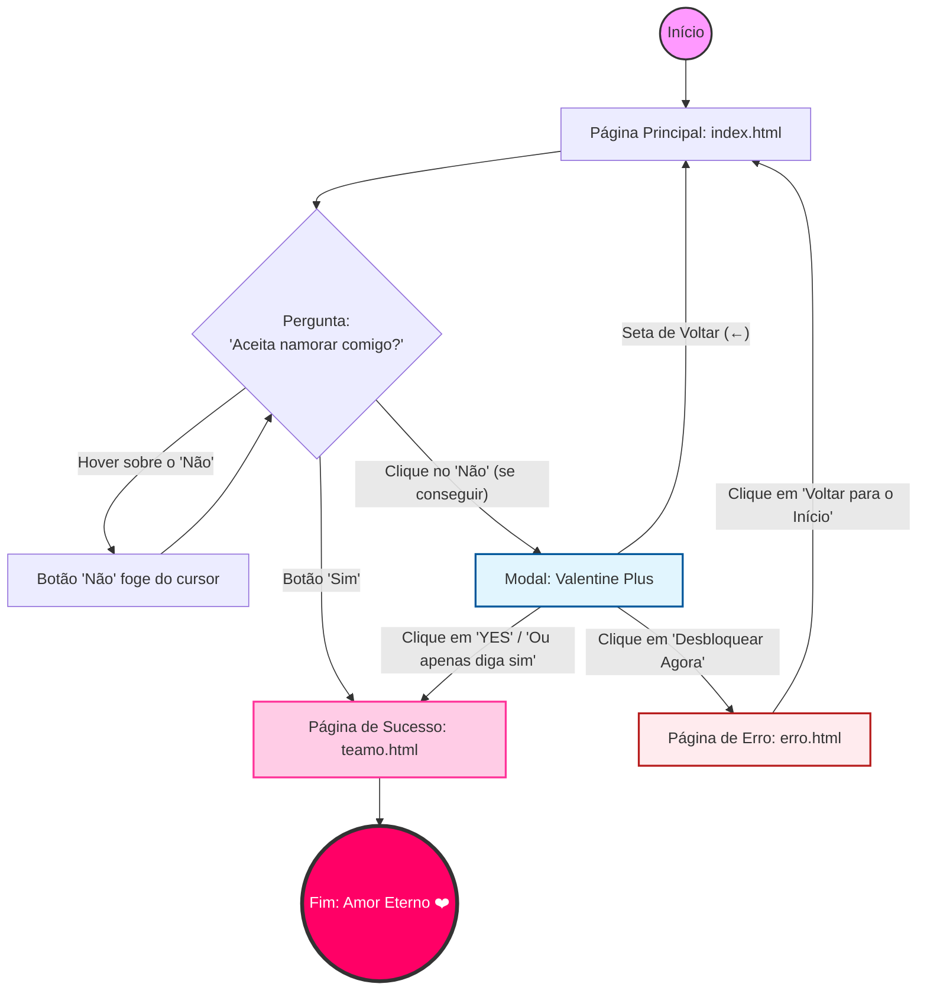

# Fluxograma do Projeto - Pedido de Namoro Irrecusável

Este fluxograma descreve a jornada do usuário e a lógica de interação do aplicativo.

```mermaid
flowchart TD
    %% Nós Principais
    START((Início)) --> INDEX[Página Principal: index.html]
    
    INDEX --> QUESTION{Pergunta: <br/>'Aceita namorar comigo?'}
    
    %% Caminho do Sim
    QUESTION -- "Botão 'Sim'" --> SUCCESS[Página de Sucesso: teamo.html]
    SUCCESS --> HAPPY_END((Fim: Amor Eterno ❤️))
    
    %% Caminho do Não
    QUESTION -- "Hover sobre o 'Não'" --> MOVE[Botão 'Não' foge do cursor]
    MOVE --> QUESTION
    
    QUESTION -- "Clique no 'Não' (se conseguir)" --> POPUP[Modal: Valentine Plus]
    
    %% Interação no Popup
    POPUP -- "Clique em 'Desbloquear Agora'" --> ERROR_PAGE[Página de Erro: erro.html]
    POPUP -- "Clique em 'YES' / 'Ou apenas diga sim'" --> SUCCESS
    POPUP -- "Seta de Voltar (←)" --> INDEX
    
    %% Página de Erro
    ERROR_PAGE -- "Clique em 'Voltar para o Início'" --> INDEX

    %% Estilização
    style START fill:#f9f,stroke:#333,stroke-width:2px
    style HAPPY_END fill:#f06,stroke:#333,stroke-width:4px,color:#fff
    style SUCCESS fill:#ffcce6,stroke:#ff3399,stroke-width:2px
    style POPUP fill:#e1f5fe,stroke:#01579b,stroke-width:2px
    style ERROR_PAGE fill:#ffebee,stroke:#b71c1c,stroke-width:2px
```
