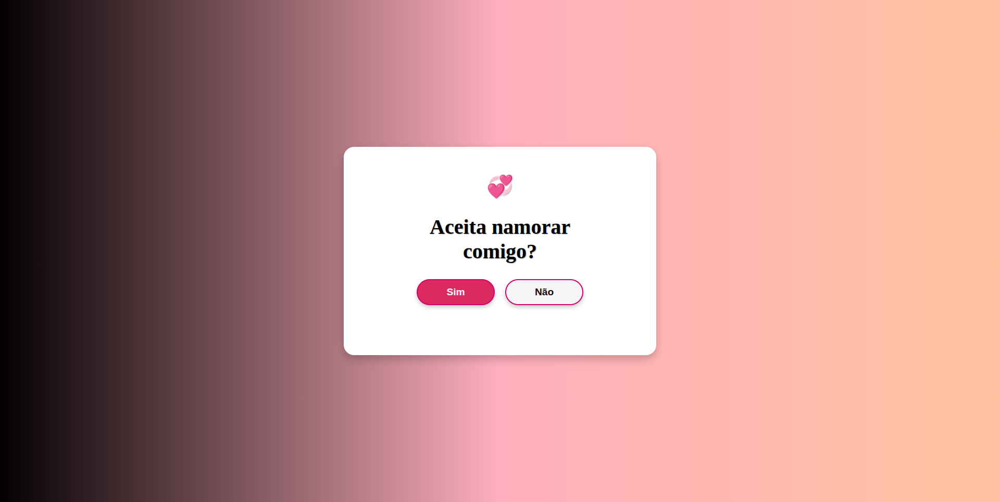
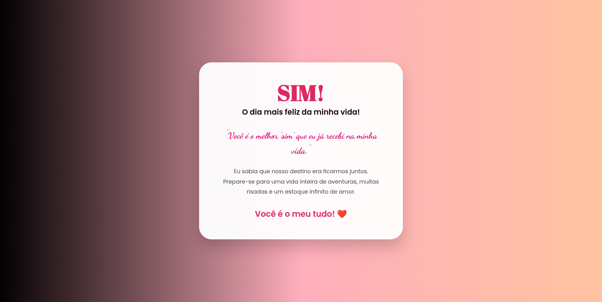
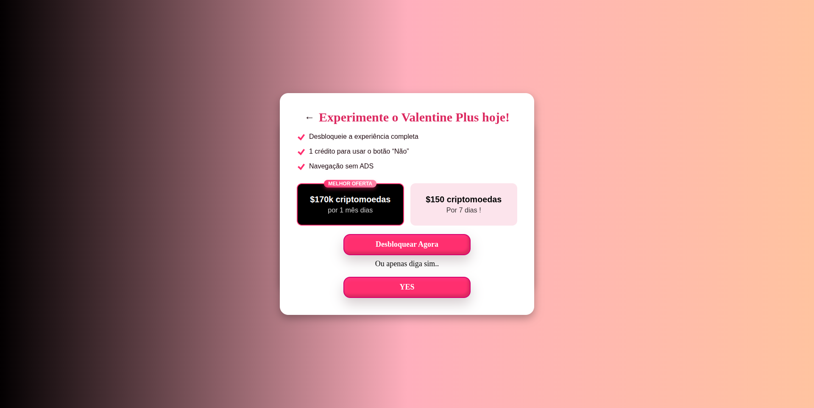
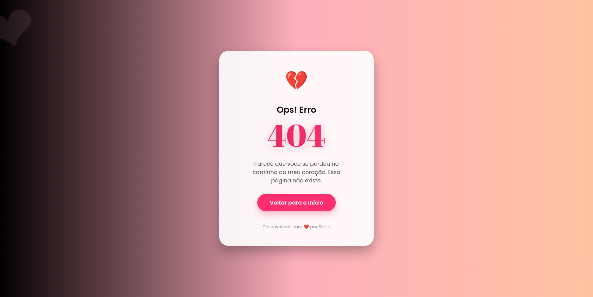

  <h1 align="center">
       Pedido de Namoro Irrecusável
    <br />
    <br />
  <a href="https://github.com/StellaKarolinaNunes/Website-pedido-de-namoro-irrecusavel">
     
    </a>
  </h1>

 </div>
 
<p align="center">
  
  
  
  
  
</p>

<br>

 ---

##  Introdução

Este projeto é uma aplicação web interativa projetada para transformar o clássico pedido de namoro em uma jornada digital inesquecível. Com um design elegante, animações fluidas e uma abordagem divertida (incluindo o famoso botão "Não" que foge do cursor), o site garante uma experiência emocionante e, claro, um "Sim" garantido!

<br>

## Por que "Pedido de Namoro Irrecusável"?

O nome "Pedido de Namoro Irrecusável" foi escolhido para refletir a natureza divertida e confiante do projeto. A ideia é criar uma experiência tão envolvente e charmosa que a decisão de dizer "sim" se torne inevitável, combinando romance com um toque de humor e tecnologia moderna.

<br>

## A Solução

A solução consiste em uma interface web lúdica que utiliza JavaScript para criar uma interação onde o botão "Não" se esquiva do usuário, tornando o "Sim" a única opção prática e divertida, removendo a pressão do momento e substituindo-a por sorrisos.

<br>

## Funcionalidades Principais

*  **Botão Fujão**: Lógica em JavaScript que move o botão "Não" aleatoriamente quando o cursor se aproxima.
*  **Design Responsivo**: Interface totalmente adaptável para dispositivos móveis e desktops.
*  **Feedback Visual**: Animações suaves e transições que tornam a experiência fluida.
*  **Confirmação Interativa**: Uma tela de sucesso personalizada ao clicar no botão "Sim".
<br>

>  **Fluxograma do Projeto**: Caso queira entender a lógica de navegação e processos do aplicativo, acesse o arquivo [FLUXOGRAMA.md](FLUXOGRAMA.md).


 ---

##  Estrutura de Pastas

```text
.
├── assets                      # Arquivos de mídia e estilos
│   ├── css                     # Arquivos de estilos
│   │   ├── erro.css            # Estilos da página de erro
│   │   ├── style.css           # Estilos da página principal
│   │   └── teamo.css           # Estilos da página de sucesso
│   ├── image                   # Arquivos de imagens
│   │   ├── bug-outline.svg     # Ícone de bug
│   │   ├── cat.png             # Imagem de gato
│   │   ├── deploy.png          # Imagem de deploy
│   │   ├── favicon.ico         # Ícone do site
│   │   ├── Frame 10.svg        # Ícone de frame
│   │   └── love3.png           # Imagem de amor
│   └── js                      # Arquivos de JavaScript
│       └── script.js           # Script principal
├── pages                       # Páginas do site
│   ├── erro.html               # Página de erro
│   ├── index.html              # Página principal
│   └── teamo.html              # Página de sucesso
├── LICENSE                     # Licença do projeto
└── README.md                   # README do projeto
```

 <br>

## Layout da Aplicação 

<p align="center">
  
  
  
  
</p>

 <br>

## Link Projeto online

<a href="https://website-pedido-de-namoro-irrecusavel.netlify.app/" target="_blank">  </a>

 <br>

## Instalação

### Pré-requisitos para Rodar o projeto

*  **Navegador Moderno:** (Google Chrome, Firefox, Edge, Safari, etc.)
*  **Editor de Código (Opcional):** Caso queira editar  
*  **Git (Opcional):** Para clonar o repositório.

<br>

###  Tecnologias Utilizadas

O projeto foi construído utilizando as seguintes tecnologias fundamentais:

*   **HTML5**: Para a estruturação semântica e acessível do conteúdo.
*   **CSS3**: Para animações interativas, layout flexível (Flexbox), glassmorphism e cores vibrantes.
*   **JavaScript (Vanilla)**: Responsável pela lógica da aplicação, como o botão que se esquiva do usuário e o controle do modal.
*   **Google Fonts**: Utilizado para garantir uma tipografia elegante e moderna em todo o site.

<br>

### Instalação Rápida

#### 1. Clone o repositório:

   ```bash
   git clone https://github.com/StellaKarolinaNunes/Website-pedido-de-namoro-irrecusavel
   ```

#### 2. Navegue até o diretório do projeto:

   ```bash
   cd Website-pedido-de-namoro-irrecusavel
   ```

#### 3. Abra o arquivo `index.html` em seu navegador de preferência.

<br>

## Roadmap

### v1.1.0 (Efeitos & Imersão)
- [ ] **Trilha Sonora**: Adicionar uma música de fundo romântica ao carregar a página de sucesso.
- [ ] **Efeito de Confetes**: Implementar `Canvas Confetti` para celebrar o clique no botão "Sim".
- [ ] **Animações Extras**: Adicionar corações flutuantes mais dinâmicos no fundo.

### v1.2.0 (Personalização Dinâmica)
- [ ] **Parâmetros de URL**: Permitir que o usuário passe o nome da pessoa via URL (ex: `?nome=Julia`).
- [ ] **Mensagem Customizada**: Opção de alterar o texto do pedido através da URL.
- [ ] **Galeria de Fotos**: Espaço para carregar fotos do casal na página de sucesso.

### v2.0.0 (Interatividade Avançada)
- [ ] **Dashboard de Configuração**: Interface simples para gerar links personalizados sem mexer no código.
- [ ] **Contagem Regressiva**: Adicionar um contador de "tempo juntos" após o aceite.
- [ ] **Integração com WhatsApp**: Botão para notificar o autor do pedido assim que o "Sim" for clicado.

<br>

## Contribuição

Contribuições são muito bem-vindas para tornar este projeto ainda mais especial!

### Como Contribuir
1. **Fork** este repositório
2. **Clone** seu fork localmente
3. **Crie** uma branch para sua feature: `git checkout -b feature/nova-funcionalidade`
4. **Faça** suas alterações e commits
5. **Teste** suas modificações
6. **Abra** um Pull Request detalhado

<br>

###  Diretrizes

- Código limpo e bem comentado
- Mensagens de commit claras e objetivas
- Teste todas as funcionalidades
- Mantenha a documentação atualizada
- Siga os padrões de código existentes

<br>

##  Licença

Este projeto está licenciado sob a [Licença MIT](LICENSE).

``` bash
MIT License - você pode usar, modificar e distribuir livremente,
mantendo a referência ao repositório original.
```

 <br>

 ## Contato

 Se você tiver dúvidas, sugestões ou quiser saber mais sobre o projeto, entre em contato:

 - **Principais Desenvolvedores:** [Stella Karolina](https://github.com/StellaKarolinaNunes)
 - **Repositório:** [Pedido de namoro irrecusável no GitHub](https://github.com/StellaKarolinaNunes/Website-pedido-de-namoro-irrecusavel)
 - **LinkedIn:** [Stella Karolina Nunes](https://www.linkedin.com/in/stella-karolina/)

 <br>

 ## Créditos

 O **Pedido de namoro irrecusável** foi construído com o apoio de tecnologias e comunidades incríveis:

 - **Tipografia:** [Google Fonts](https://fonts.google.com/) (Poppins, Abril Fatface, Dancing Script).
 - **Estilização:** CSS Premium inspirado em tendências de *Glassmorphism* e *Neumorphism*.
 - **Lógica:** Vanilla JavaScript puro, sem dependências externas.
 - **Hospedagem:** [Netlify](https://www.netlify.com/) (Deploy rápido e contínuo).
 - **IA de Codificação:** Desenvolvido com suporte do **Antigravity**, o assistente digital agentic de codificação do Google Deepmind.

 <br>

 
### Desenvolvimento Principal

<table>
  <tr>
    <td align="center">
      <a href="https://github.com/StellaKarolinaNunes">
        
        <br />
        <sub><b>Stella Karolina (Desenvolvedora)</b></sub>
        <br />
      </a>
    </td>
  </tr>
</table>

 