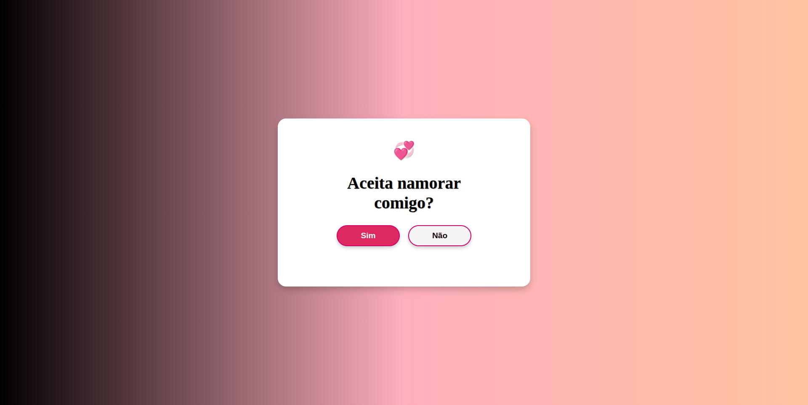
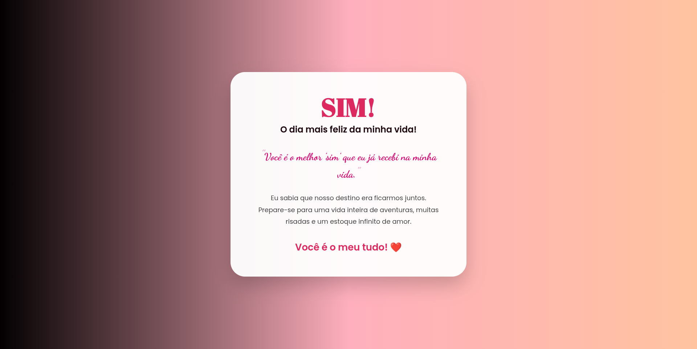
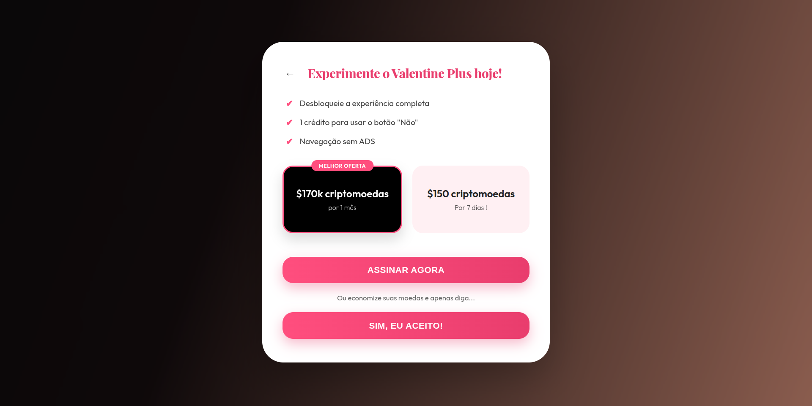
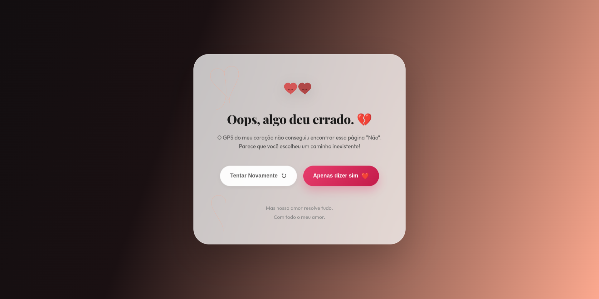

<div align="center">

# Pedido de Namoro Irrecusável

### Experiência web interativa para transformar um pedido de namoro em uma surpresa digital divertida e personalizada

<a href="https://github.com/StellaKarolinaNunes/Website-pedido-de-namoro-irrecusavel">
  
</a>

<br>


<br><br>

<p align="center">
  <a href="https://website-pedido-de-namoro-irrecusavel.netlify.app/">
    
  </a>
  <a href="https://github.com/StellaKarolinaNunes/Website-pedido-de-namoro-irrecusavel">
    
  </a>
  <a href="./FLUXOGRAMA.md">
    
  </a>
</p>

</div>

---

## Sobre o projeto

O **Pedido de Namoro Irrecusável** é uma aplicação web interativa criada para transformar um pedido de namoro em uma experiência digital divertida, afetiva e memorável.

A interface apresenta uma pergunta principal com duas opções: **Sim** e **Não**. Enquanto o botão de confirmação direciona para uma página especial de sucesso, o botão “Não” utiliza JavaScript para se mover pela tela quando o usuário tenta selecioná-lo.

O projeto combina romance, humor, animações e interação para criar uma surpresa personalizada que pode ser compartilhada por meio de um link.

> Este projeto foi desenvolvido para fins de estudo, portfólio e demonstração de interações web utilizando HTML, CSS e JavaScript puro.

---

## Objetivo

O objetivo do projeto é demonstrar como tecnologias fundamentais da web podem ser utilizadas para criar uma experiência interativa, responsiva e emocionalmente envolvente.

A aplicação trabalha conceitos como:

* estruturação de páginas HTML;
* estilização com CSS;
* responsividade;
* animações e transições;
* manipulação de eventos;
* movimentação dinâmica de elementos;
* navegação entre páginas;
* organização modular de JavaScript;
* publicação de site estático.

---

## Funcionalidades

* **Pedido interativo:** página principal com pergunta personalizada.
* **Botão “Sim”:** direciona o usuário para uma página especial de confirmação.
* **Botão “Não” fujão:** move-se aleatoriamente quando o cursor se aproxima.
* **Animações visuais:** efeitos suaves para tornar a experiência mais envolvente.
* **Corações dinâmicos:** elementos visuais decorativos para reforçar a identidade romântica.
* **Pop-up interativo:** recursos visuais para aumentar a surpresa durante a navegação.
* **Página de sucesso:** tela especial exibida após a confirmação.
* **Página alternativa de erro:** fluxo visual para situações específicas do projeto.
* **Layout responsivo:** adaptação para celulares, tablets e computadores.
* **Publicação online:** versão hospedada no Netlify.
* **Código modularizado:** scripts divididos entre lógica principal, corações e pop-ups.

---

## Tecnologias utilizadas

| Tecnologia   | Aplicação no projeto                                     |
| ------------ | -------------------------------------------------------- |
| HTML5        | Estrutura das páginas e conteúdo                         |
| CSS3         | Estilização, responsividade, animações e efeitos visuais |
| JavaScript   | Interações, botão fujão, pop-ups e lógica de navegação   |
| Google Fonts | Tipografia personalizada                                 |
| Netlify      | Publicação da versão online                              |
| Git          | Controle de versão                                       |
| GitHub       | Hospedagem do repositório                                |

---

## Destaques técnicos

* Aplicação web sem dependência de frameworks;
* Interação dinâmica criada com JavaScript puro;
* Botão “Não” com posicionamento aleatório;
* Estrutura multipágina com fluxo visual de confirmação;
* Organização de estilos por página e responsabilidade;
* JavaScript separado por módulos;
* Interface responsiva para diferentes dispositivos;
* Publicação simples como site estático;
* Projeto leve e fácil de personalizar.

---

## Fluxo de funcionamento

```text
Usuário acessa o site
        │
        ▼
Pergunta principal exibida
        │
        ├── Clica em "Sim"
        │        │
        │        ▼
        │   Página de confirmação
        │
        └── Tenta clicar em "Não"
                 │
                 ▼
        Botão muda de posição
                 │
                 ▼
        Usuário continua interagindo
```

> Para entender a lógica detalhada do projeto, consulte o arquivo [FLUXOGRAMA.md](./FLUXOGRAMA.md).

---

## Preview

<div align="center">

| Tela principal                                                                                                  | Confirmação                                                                              |
| --------------------------------------------------------------------------------------------------------------- | ---------------------------------------------------------------------------------------- |
|  |  |

<br>

| Botão Não                                                                          | Página alternativa                                                                        |
| ---------------------------------------------------------------------------------- | ----------------------------------------------------------------------------------------- |
|  |  |

</div>

---

## Projeto online

<div align="center">

<a href="https://website-pedido-de-namoro-irrecusavel.netlify.app/">
  
</a>

<br><br>

<a href="https://website-pedido-de-namoro-irrecusavel.netlify.app/">
  
</a>

</div>

---

## Estrutura do projeto

```bash
Website-pedido-de-namoro-irrecusavel/
├── assets/
│   ├── css/
│   │   ├── base.css
│   │   ├── erro.css
│   │   ├── style.css
│   │   └── teamo.css
│   │
│   ├── image/
│   │   ├── deploy.png
│   │   ├── favicon.ico
│   │   ├── Frame 10.svg
│   │   ├── love3.png
│   │   ├── tela_erro.png
│   │   ├── tela_nao.png
│   │   ├── tela_principal.png
│   │   └── tela_sim.png
│   │
│   └── js/
│       ├── modules/
│       │   ├── heart.js
│       │   └── popup.js
│       │
│       └── script.js
│
├── pages/
│   ├── erro.html
│   ├── index.html
│   └── teamo.html
│
├── FLUXOGRAMA.md
├── LICENSE
└── README.md
```

### Responsabilidade dos arquivos

| Arquivo ou pasta             | Responsabilidade                       |
| ---------------------------- | -------------------------------------- |
| `pages/index.html`           | Página principal do pedido             |
| `pages/teamo.html`           | Página exibida após a confirmação      |
| `pages/erro.html`            | Página alternativa do fluxo            |
| `assets/css/style.css`       | Estilos da página principal            |
| `assets/css/teamo.css`       | Estilos da página de confirmação       |
| `assets/css/erro.css`        | Estilos da página alternativa          |
| `assets/js/script.js`        | Lógica principal da interação          |
| `assets/js/modules/heart.js` | Criação e animação de corações         |
| `assets/js/modules/popup.js` | Controle dos pop-ups do projeto        |
| `FLUXOGRAMA.md`              | Fluxo e documentação lógica do sistema |

---

## Como executar o projeto

### Pré-requisitos

Antes de iniciar, é necessário ter instalado:

* navegador atualizado, como Google Chrome, Firefox, Microsoft Edge ou Safari;
* Git, para clonar o repositório;
* editor de código opcional, como VS Code;
* extensão Live Server opcional para desenvolvimento local.

### 1. Clone o repositório

```bash
git clone https://github.com/StellaKarolinaNunes/Website-pedido-de-namoro-irrecusavel.git
```

### 2. Acesse a pasta do projeto

```bash
cd Website-pedido-de-namoro-irrecusavel
```

### 3. Abra a página principal

Como o arquivo `index.html` está dentro da pasta `pages`, abra:

```bash
xdg-open pages/index.html
```

No macOS:

```bash
open pages/index.html
```

No Windows:

```bash
start pages/index.html
```

---

## Executar com Live Server

Para uma experiência de desenvolvimento mais prática no VS Code:

1. Instale a extensão **Live Server**;
2. Abra a pasta do projeto no VS Code;
3. Abra o arquivo `pages/index.html`;
4. Clique com o botão direito;
5. Selecione **Open with Live Server**.

---

## Roadmap

### Experiência e imersão

* [x] Página principal interativa;
* [x] Botão “Não” com movimento dinâmico;
* [x] Página de confirmação;
* [x] Animações e elementos visuais românticos;
* [x] Layout responsivo;
* [x] Deploy no Netlify;
* [ ] Adicionar música de fundo opcional;
* [ ] Criar efeito de confetes ao clicar em “Sim”;
* [ ] Adicionar mais animações de corações no fundo;
* [ ] Criar transições entre páginas.

### Personalização

* [ ] Permitir alterar o nome da pessoa por URL;
* [ ] Permitir personalizar a mensagem principal;
* [ ] Adicionar galeria de fotos do casal;
* [ ] Criar opção de editar cores e tipografia;
* [ ] Criar diferentes modelos de pedido;
* [ ] Permitir incluir data especial no pedido.

### Evoluções futuras

* [ ] Criar painel visual para gerar links personalizados;
* [ ] Adicionar contador de tempo juntos;
* [ ] Integrar envio de confirmação via WhatsApp;
* [ ] Criar versão PWA instalável;
* [ ] Adicionar modo escuro;
* [ ] Criar página com QR Code para compartilhar o pedido;
* [ ] Salvar personalizações no navegador com `localStorage`.

---

## Contribuição

Contribuições são bem-vindas para tornar o projeto mais criativo, responsivo e personalizável.

```bash
# Faça um fork do repositório no GitHub

# Clone o seu fork
git clone https://github.com/SEU-USUARIO/Website-pedido-de-namoro-irrecusavel.git

# Acesse a pasta do projeto
cd Website-pedido-de-namoro-irrecusavel

# Crie uma branch para sua alteração
git checkout -b feature/nova-funcionalidade

# Faça as alterações e teste no navegador

# Adicione os arquivos alterados
git add .

# Crie um commit descritivo
git commit -m "feat: adiciona novo efeito visual"

# Envie a branch para o GitHub
git push origin feature/nova-funcionalidade
```

Depois, abra um Pull Request explicando:

* o objetivo da alteração;
* quais arquivos foram modificados;
* como a funcionalidade foi testada;
* se houve alteração visual ou de responsividade;
* se foram adicionadas novas imagens, fontes ou scripts.

### Diretrizes

* Mantenha o código organizado e legível;
* Preserve a separação entre HTML, CSS e JavaScript;
* Evite adicionar dependências externas sem necessidade;
* Teste o comportamento em desktop e celular;
* Mantenha as animações leves;
* Preserve o funcionamento do botão interativo;
* Otimize imagens antes de adicioná-las ao repositório;
* Atualize o README quando novas funcionalidades forem incluídas.

---

## Licença

Este projeto está licenciado sob a [Licença MIT](LICENSE).

```text
MIT License

Você pode usar, modificar e distribuir este projeto,
desde que mantenha os créditos e a referência ao repositório original.
```

---

## Créditos

### Desenvolvimento

* **Desenvolvimento principal:** [Stella Karolina Nunes](https://github.com/StellaKarolinaNunes)

### Tecnologias e recursos

* **Estrutura:** HTML5;
* **Estilização:** CSS3;
* **Interações:** JavaScript puro;
* **Tipografia:** [Google Fonts](https://fonts.google.com/);
* **Hospedagem:** [Netlify](https://www.netlify.com/);
* **Controle de versão:** Git e GitHub;
* **Badges:** [Shields.io](https://shields.io/).
